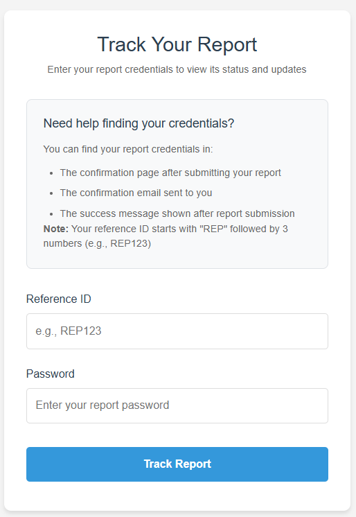
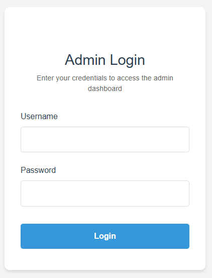

# RUBIX - Secure Whistleblowing Platform


RUBIX is a secure and anonymous platform for reporting workplace incidents. It provides a safe environment for employees to report misconduct while ensuring their privacy and security.

## Features

- **100% Anonymous Reporting**: Your identity is protected with state-of-the-art encryption
- **Real-time Updates**: Track your report's progress and receive instant notifications
- **Verified Process**: Every report is handled by trained professionals
- **Secure Platform**: Built with modern security practices
- **User-friendly Interface**: Easy to use for both reporters and administrators

## Platform Screenshots

### Report Submission Page


### Report Tracking Page


### Admin Dashboard


### Additional Features


## Technology Stack

- **Backend**: Python (Flask)
- **Frontend**: HTML, CSS, JavaScript
- **Database**: SQLite
- **Security**: Custom encryption and security measures
- **AI Integration**: Gemini AI for report analysis

## Prerequisites

- Python 3.8 or higher
- pip (Python package installer)
- Virtual environment (recommended)

## Installation

1. Clone the repository:
```bash
git clone https://github.com/yourusername/RUBIX.git
cd RUBIX
```

2. Create and activate a virtual environment:
```bash
python -m venv venv
# On Windows
venv\Scripts\activate
# On Unix or MacOS
source venv/bin/activate
```

3. Install dependencies:
```bash
pip install -r requirements.txt
```

4. Initialize the database:
```bash
python create_admin.py
```

## Configuration

1. Create a `.env` file in the root directory with the following variables:
```
SECRET_KEY=your_secret_key
ADMIN_EMAIL=your_admin_email
ADMIN_PASSWORD=your_admin_password
```

2. Update the configuration in `app2.py` if needed.

## Running the Application

1. Start the Flask development server:
```bash
python app2.py
```

2. Access the application at `http://localhost:5000`

## Project Structure

```
RUBIX/
├── static/
│   ├── css/
│   ├── js/
│   └── images/
│       ├── pic1.png  # Home page screenshot
│       ├── pic2.png  # Report page screenshot
│       ├── pic3.png  # Admin dashboard screenshot
│       ├── pic4.png  # Tracking page screenshot
│       └── pic5.png  # Additional features screenshot
├── templates/
│   ├── base.html
│   ├── home.html
│   ├── report.html
│   └── track.html
├── instance/
├── venv/
├── app2.py
├── gemini_utils.py
├── security.py
├── create_admin.py
└── requirements.txt
```

## Security Features

- End-to-end encryption for all reports
- Anonymous reporting system
- Secure password hashing
- Protection against common web vulnerabilities
- Regular security audits

## Contributing

1. Fork the repository
2. Create a feature branch
3. Commit your changes
4. Push to the branch
5. Create a Pull Request

## License

This project is licensed under the MIT License - see the LICENSE file for details.

## Support

For support, please email support@rubix.com or create an issue in the repository.

## Acknowledgments

- Flask framework
- Gemini AI
- All contributors and users of RUBIX

---

*Note: The images in the static/images directory should be:*
- *pic1.png: Screenshot of the home page*
- *pic2.png: Screenshot of the report submission page*
- *pic3.png: Screenshot of the admin dashboard*
- *pic4.png: Screenshot of the report tracking page*
- *pic5.png: Screenshot of additional features*
